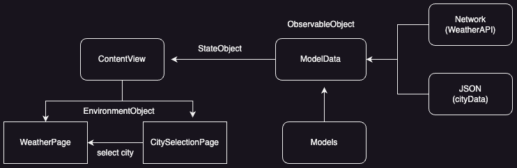
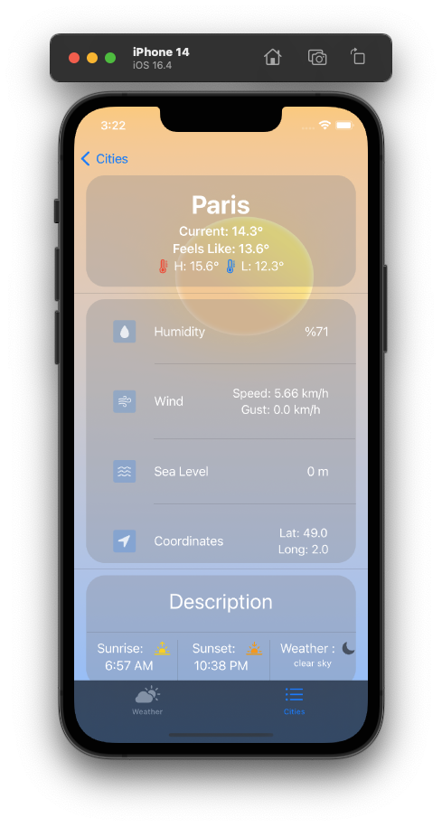
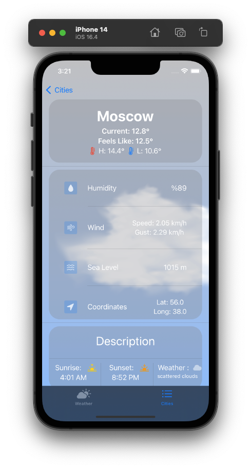
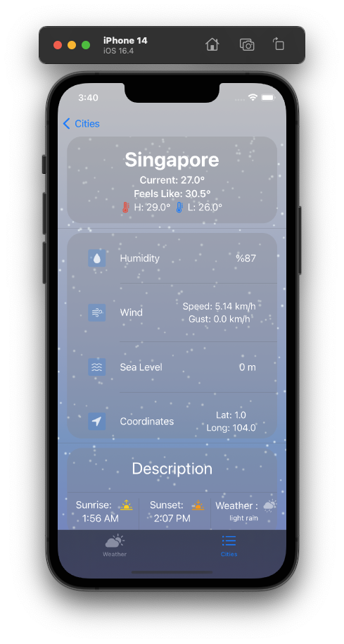
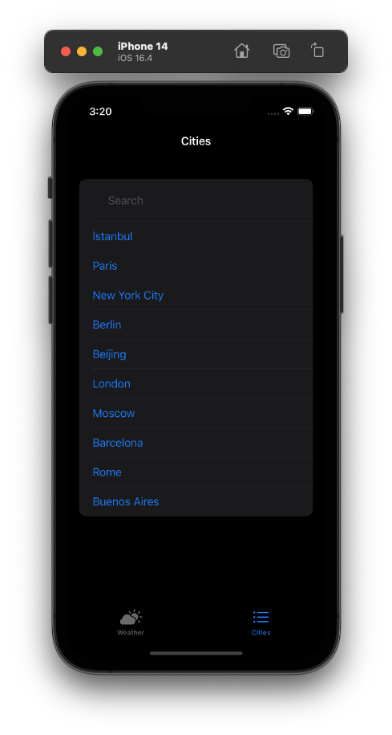
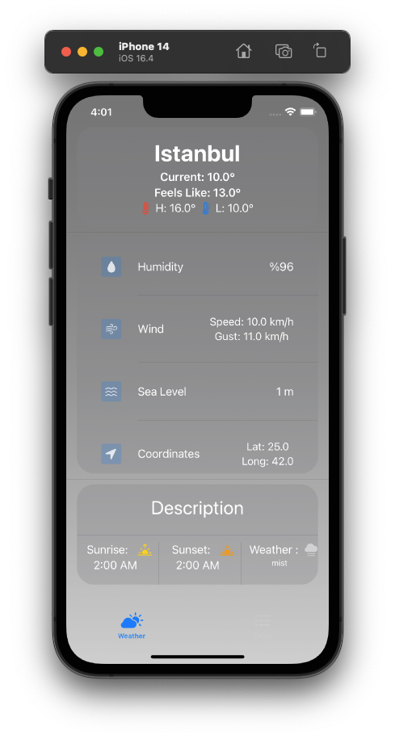

# Simple Weather App

This project is a simple weather iOS app with a MVC architecture. Developed for adesso internship case.

- Location based weather
- SpriteKit animations (Sunny, Rainy, Snowy, Drizzle, Cloudy)
- Search Cities
- MVC Architecture

## Libraries/Dependencies

- SwiftUI
- [Moya](https://github.com/Moya/Moya): Network abstraction library.
- SpriteKit: 2D game engine.
- CoreLocation: Framework for location based services.
- [EasySkeleton](https://github.com/SpectralDragon/EasySkeleton): Loading animation for SwiftUI.
- [OpenWeather API](https://openweathermap.org/api)

## Architecture

- MVC (Model-View-Controller)
  

    

  
## Screen Shots

## Assets

- https://pngtree.com/so/white
- https://www.freepik.com/free-psd/realistic-clouds-isolated_41576353.htm#from_view=detail_serie
- [@liammews](https://www.figma.com/@liammews)
  
